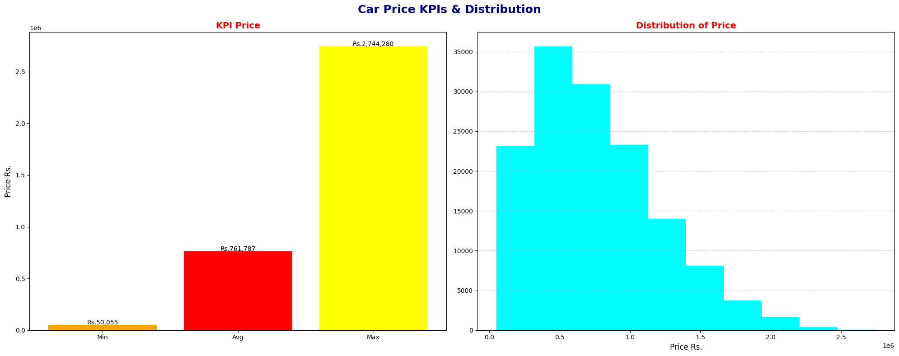
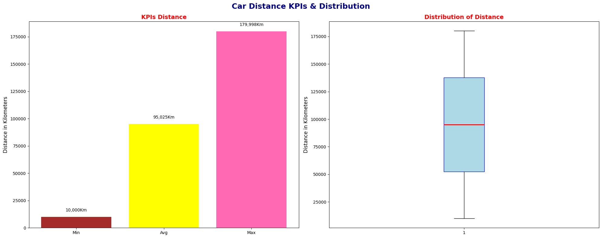
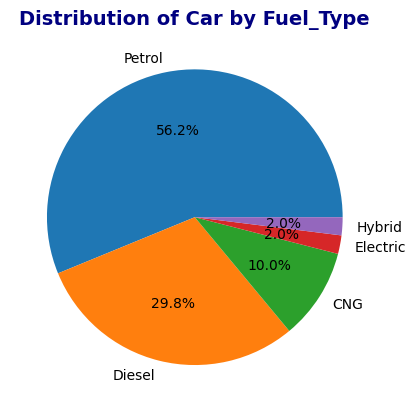
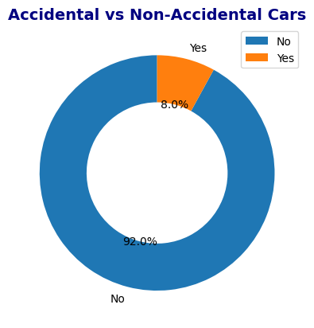
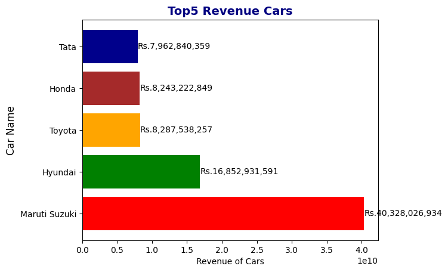
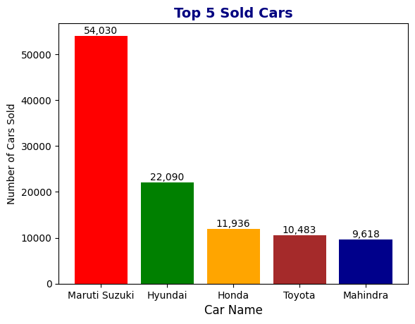
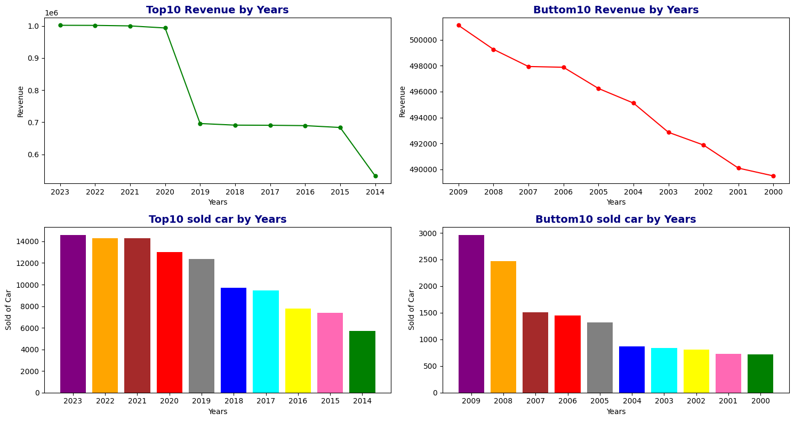

# Car_Sales_Price_EDA

## 📘 Project Overview
This project focuses on **Exploratory Data Analysis (EDA)** of a car sales dataset to uncover insights about car prices, mileage, brand performance, and sales distribution across different regions and years.  
All visualizations are created using **Matplotlib**, and the analysis highlights both **Price** and **Kilometers (Distance)** as the main KPIs.

---

## 🧩 Dataset
- The dataset contains records of **140,904** cars.
- Key columns include:
  - `Brand`, `Car Type`, `Transmission`, `Fuel Type`, `Year`, `Kilometers`, `Owner`, `State`, `Accidental`, `Price`
- Covers data from multiple states in India between 2001 and 2022.

### Dataset Source
The dataset has been downloaded from **Kaggle**:  
[Car Sales Dataset on Kaggle](https://www.kaggle.com/datasets/milapgohil/car-dataset)

## 🛠 Tools & Libraries
- **Python 3.x**
- **Pandas** – Data cleaning and manipulation  
- **NumPy** – Statistical computations  
- **Matplotlib** – Data visualization  
- **Jupyter Notebook** – Analysis and reporting  

---

## 📊 KPI Insights

1. **Car Price Analysis**
   - **Total Profit:** ₹107,338,859,947  
   - **Average Price:** ₹761,787  
   - **Maximum Price:** ₹2,744,280  
   - **Minimum Price:** ₹50,055  
   - Most cars fall in the mid-price range (₹4–10 lakhs), with a few luxury vehicles priced higher.  
    

2. **Kilometers (Distance) Analysis**
   - **Total Distance Driven:** 13,389,345,673 km  
   - **Average Distance:** 95,024 km  
   - **Maximum Distance:** 179,998 km  
   - **Minimum Distance:** 10,000 km  
   - Majority of vehicles have moderate mileage (50 K–140 K km), showing balanced usage.  

   
---

## 🔍 EDA Insights

1. **State-wise Revenue (Top & Bottom States)**  
   - **Maharashtra** contributed the **highest revenue** (₹19.46 B) ≈ **18.14 %** of total sales.  
   - **Puducherry** had the **lowest revenue** (₹0.19 B) ≈ **0.18 %** of total sales.  
     

2. **Fuel Type Distribution**  
   - **Petrol:** 56.2 % | **Diesel:** 29.8 % | **CNG:** 10 % | **Hybrid & Electric:** ~2 %  
   - Petrol cars dominate the market, while electric and hybrid vehicles remain minimal.  

    
3. **Accidental vs Non-Accidental Cars**  
   - **Accidental:** 8 % | **Non-Accidental:** 92 %  
   - Indicates that most vehicles are in good condition; buyers prefer non-accidental cars.  
 

4. **Top 5 Revenue-Generating Brands**  
   | Brand | Total Revenue (₹) |
   |--------|------------------:|
   | Maruti Suzuki | 40.32 B |
   | Hyundai | 16.85 B |
   | Toyota | 8.28 B |
   | Honda | 8.24 B |
   | Tata | 7.96 B |
   - **Maruti Suzuki** alone contributes ~37.6 % of total sales revenue.  
     

5. **Top 5 Selling Car Brands**  
   | Brand | Cars Sold |
   |--------|----------:|
   | Maruti Suzuki | 54,030 |
   | Hyundai | 22,090 |
   | Honda | 11,936 |
   | Toyota | 10,483 |
   | Mahindra | 9,618 |
   - **Maruti Suzuki** leads with nearly 50 % share among the top-selling brands.  
    

6. **Top & Bottom 10 Years Comparison (Revenue & Units Sold)**  
   - Top years show peak sales and revenue — representing strong market demand.  
   - Bottom years reflect slower market periods or lower-priced cars.  
   - Some years show high revenue despite fewer sales — due to premium car influence.  
   

---

## 🧠 Conclusion
The analysis provides deep insights into **car pricing trends, sales distribution, and market performance** across India.  
- **Maruti Suzuki** dominates both in total revenue and number of cars sold.  
- **Maharashtra** is the most profitable market state.  
- **Petrol cars** hold the largest market share, while **Electric vehicles** are still emerging.  
- **Most cars are non-accidental**, showing positive quality standards.  

---

## ▶️ How to Run
1. Clone the repository:  
 git clone
   https://github.com/btwitravi/Car_Sales_Price_EDA.git

2. Open the Jupyter Notebook:

jupyter notebook Car_Price_analysis.ipynb

3. Install required libraries:

pip install pandas numpy matplotlib 

